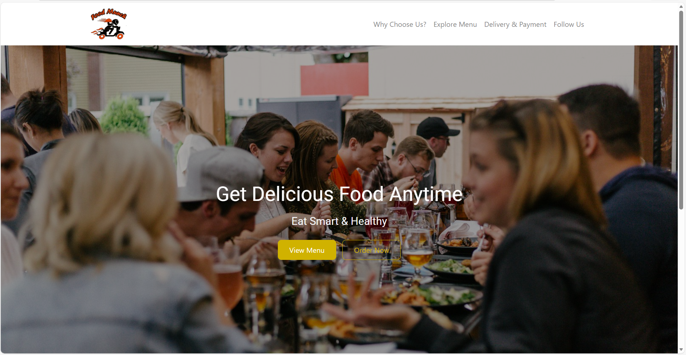

# 🍴 Food Munch Website

A responsive food-ordering website built using **HTML**, **CSS**, and **Bootstrap 4**.  
This project includes a hero banner with a dark overlay, clean layout, action buttons, and a “Why Choose Us” section — all with fully local image assets.

## 🔥 Features

- Responsive Navbar and Banner  
- Dark overlay for clean text visibility  
- “Why Choose Us” section with reusable cards  
- Clean UI with smooth spacing  
- Local images for fast loading  
- Fully responsive using Bootstrap grid system  

## 🛠️ Technologies Used

- **HTML5**  
- **CSS3**  
- **Bootstrap 4**

## 🖼️ Preview



## 📂 Project Structure

```
project/
│── index.html
│── style.css
│── README.md
└── assets/
     └── images/
          ├── Food_munchi_img.jpg
          ├── Banner.jpeg
          ├── Dining_Experience.jpg
          ├── Fresh_Vegetables.jpg
          └── 50_Off.jpeg
```

## 💻 How to Run

1. Clone the repository  
   ```bash
   git clone https://github.com/Balla-Hemanth-Srinivas/Food-Munch.git
   ```

2. Open the project folder  
3. Run **index.html** in your browser  

## 🏷️ Badges


## 👤 About Me

**Your Name**  
Frontend Developer | Web Designer  
Passionate about building clean, beautiful, and responsive UI.

## ⭐ Support

If you like this project, please give it a **⭐ star** on GitHub!
